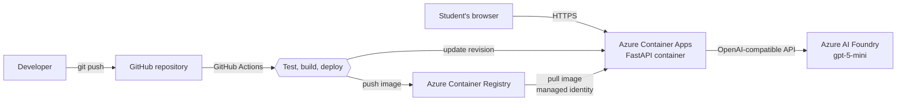
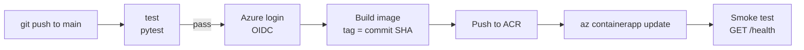

# QuizMaker

An AI-powered revision tool: **upload a course, get a quiz, get corrected, and receive a personalised report of what to work on.**

Built as a cloud computing project: a small LLM application, containerised with Docker, deployed on Microsoft Azure through a fully automated GitHub Actions CI/CD pipeline.

- **Live demo:** https://quizmaker.livelymoss-fec77fd0.francecentral.azurecontainerapps.io
- **Demo video:** `ADD THE VIDEO LINK HERE`

> The first request after a period of inactivity can take a few seconds: the app scales down to zero replicas when unused to save cloud credits.

---

## 1. The problem

Students re-read their courses but rarely test themselves, which is the most effective way to learn. Writing good practice questions by hand takes time.

QuizMaker removes that friction:

1. Upload a course (PDF, DOCX, TXT, MD) or paste its text.
2. The LLM generates a multiple-choice quiz based **only** on that course.
3. Answer the questions, then get an instant correction with an explanation for each one.
4. Receive a **revision report**: a short summary, your strengths, and the specific topics to work on with concrete advice.

## 2. Architecture



| Component | Role |
|---|---|
| **FastAPI** (Python 3.12) | Backend API and static web page |
| **Azure AI Foundry** (`gpt-5-mini`) | Generates the quiz and the revision report |
| **Docker** | Packages the app so it runs identically everywhere |
| **Azure Container Registry** | Stores the versioned Docker images |
| **Azure Container Apps** | Runs the container and exposes a public HTTPS URL |
| **GitHub Actions** | Tests, builds and deploys automatically on every push |

### API

| Route | Description |
|---|---|
| `GET /` | Web interface |
| `GET /health` | Health check (used by Docker and by the pipeline smoke test) |
| `POST /api/extract` | Extracts text from an uploaded PDF, DOCX, TXT or MD file |
| `POST /api/quiz` | Generates a quiz from the course text |
| `POST /api/report` | Generates the revision report from the quiz results |

### Notable design decisions

- **Provider-independent LLM layer.** The app uses the `openai` SDK with three environment variables (`LLM_BASE_URL`, `LLM_API_KEY`, `LLM_MODEL`). Switching from Azure to another OpenAI-compatible provider needs no code change.
- **Answers are shuffled in code, not by the LLM.** Models tend to put the correct answer first; the backend shuffles the choices and recomputes the correct index.
- **Validated LLM output.** The quiz is requested as JSON and checked (four choices, valid answer index). A malformed answer returns a clean `502` instead of crashing the interface.
- **Safe rendering.** The front-end builds the DOM with `textContent`, never `innerHTML`, so generated text cannot inject HTML.

## 3. Repository structure

```
.
├── app/
│   ├── main.py              # FastAPI application
│   └── static/index.html    # Web interface
├── tests/test_app.py        # Automated tests (LLM calls are mocked)
├── .github/workflows/ci-cd.yml   # CI/CD pipeline
├── Dockerfile
├── .dockerignore
├── requirements.txt         # Runtime dependencies
├── requirements-dev.txt     # Test dependencies
├── pytest.ini
└── .env.example             # Configuration template (never commit the real .env)
```

## 4. Run it locally

**Prerequisites:** Python 3.12, an OpenAI-compatible LLM endpoint (e.g. an Azure AI Foundry deployment).

```powershell
python -m venv .venv
.venv\Scripts\Activate.ps1
pip install -r requirements.txt

copy .env.example .env      # then fill in your own values
# Load the variables into the current PowerShell session:
Get-Content .env | Where-Object { $_ -match '^[A-Z]' } | ForEach-Object { $k,$v = $_ -split '=',2; Set-Item "env:$k" $v }

uvicorn app.main:app --reload
```

Open http://127.0.0.1:8000.

For Azure, `LLM_BASE_URL` is the resource endpoint followed by `/openai/v1/`, and `LLM_MODEL` is the **deployment name**.

Run the tests:

```
pip install -r requirements-dev.txt
pytest -q
```

## 5. Run it with Docker

```
docker build -t quizmaker .
docker run --rm -p 8000:8000 --env-file .env quizmaker
```

The secrets are injected at runtime with `--env-file`; `.dockerignore` guarantees `.env` is never copied into the image. The container runs as a non-root user and defines a `HEALTHCHECK` on `/health`.

## 6. Azure deployment

The infrastructure was created with the Azure CLI (commands below, so the setup is reproducible). Replace the placeholders with your own values.

```bash
# Resource group and container registry
az group create --name rg-quizmaker --location francecentral
az acr create --resource-group rg-quizmaker --name <REGISTRY_NAME> --sku Basic

# First image push
az acr login --name <REGISTRY_NAME>
docker tag quizmaker <REGISTRY_NAME>.azurecr.io/quizmaker:v1
docker push <REGISTRY_NAME>.azurecr.io/quizmaker:v1

# Container Apps environment and application
az containerapp env create --name env-quizmaker --resource-group rg-quizmaker --location francecentral

az containerapp create \
  --name quizmaker --resource-group rg-quizmaker --environment env-quizmaker \
  --image <REGISTRY_NAME>.azurecr.io/quizmaker:v1 \
  --registry-server <REGISTRY_NAME>.azurecr.io --registry-identity system \
  --target-port 8000 --ingress external \
  --min-replicas 0 --max-replicas 1 --cpu 0.5 --memory 1.0Gi \
  --secrets "llm-api-key=<YOUR_API_KEY>" \
  --env-vars "LLM_BASE_URL=<ENDPOINT>/openai/v1/" "LLM_MODEL=<DEPLOYMENT_NAME>" "LLM_API_KEY=secretref:llm-api-key"
```

Key choices:

- **Managed identity for the registry** (`--registry-identity system`): the app pulls its image without any stored password.
- **API key stored as an Azure secret** and referenced with `secretref:`; it never appears in the code, the image or the repository.
- **Scale to zero** (`--min-replicas 0`) and a **maximum of one replica**: cost control on a student subscription.

## 7. CI/CD pipeline

Defined in [`.github/workflows/ci-cd.yml`](.github/workflows/ci-cd.yml).

| Job | Trigger | What it does |
|---|---|---|
| `test` | Every push and pull request | Installs dependencies and runs the test suite |
| `build-check` | Pull requests only | Builds the Docker image to verify the Dockerfile, deploys nothing |
| `deploy` | Push to `main`, after `test` passes | Logs in to Azure, builds and pushes the image, updates the Container App, runs a smoke test |



**Best practices applied**

- **Passwordless authentication with OpenID Connect (OIDC).** GitHub Actions gets a short-lived token from Azure; no Azure password or long-lived key is stored in GitHub. The trust is restricted to this repository and the `main` branch.
- **Least privilege.** The pipeline identity only has `Contributor` on the project resource group and `AcrPush` on the registry.
- **Immutable, traceable images.** Each image is tagged with the Git commit SHA, so every running version maps to an exact commit and rollbacks are trivial.
- **Quality gate.** Nothing is deployed unless the tests pass.
- **Post-deployment verification.** A smoke test calls `/health` with retries (the app may be cold-starting) and fails the pipeline if the new version does not respond.

### Setting up the pipeline identity (one-time)

```bash
SUB_ID=$(az account show --query id -o tsv)
APP_ID=$(az ad app create --display-name github-quizmaker --query appId -o tsv)
SP_ID=$(az ad sp create --id $APP_ID --query id -o tsv)

az role assignment create --assignee-object-id $SP_ID --assignee-principal-type ServicePrincipal \
  --role Contributor --scope /subscriptions/$SUB_ID/resourceGroups/rg-quizmaker
az role assignment create --assignee-object-id $SP_ID --assignee-principal-type ServicePrincipal \
  --role AcrPush --scope $(az acr show --name <REGISTRY_NAME> --query id -o tsv)

az ad app federated-credential create --id $APP_ID --parameters '{
  "name": "github-main",
  "issuer": "https://token.actions.githubusercontent.com",
  "subject": "repo:<OWNER>@<OWNER_ID>/<REPO>@<REPO_ID>:ref:refs/heads/main",
  "audiences": ["api://AzureADTokenExchange"]}'
```

> The `subject` must match the claim GitHub sends. It is displayed in the logs of the *Azure login* step; for this repository it includes the numeric owner and repository IDs.

Then add three **GitHub repository secrets** (Settings > Secrets and variables > Actions): `AZURE_CLIENT_ID`, `AZURE_TENANT_ID`, `AZURE_SUBSCRIPTION_ID`. These are identifiers, not passwords.

## 8. Security and secrets management

| Secret | Where it lives |
|---|---|
| LLM API key (local) | `.env`, git-ignored and docker-ignored |
| LLM API key (production) | Azure Container Apps secret |
| Azure credentials for CI/CD | None stored: OIDC federation |
| Registry access for the app | Managed identity |

## 9. Limitations and possible improvements

- Add authentication and rate limiting: the public endpoint consumes LLM credits.
- Add a staging environment with a manual approval before production.
- Store the API key in Azure Key Vault and reference it from the Container App.
- Support scanned PDFs through OCR.
- Infrastructure as Code (Bicep or Terraform) instead of CLI commands.
- Persist quiz history per user to track progress over time.

## 10. Cost control

The whole project runs on an Azure student subscription: Basic-tier registry, a single 0.5 vCPU replica that scales to zero, and a small `mini` model. To remove everything and stop all charges:

```
az group delete --name rg-quizmaker
```
## 11. Explaining video

Here's the link for the Google Drive where the video is https://drive.google.com/file/d/1NIJV95i25EbI8fQEPegp6Fx62lZspQco/view?usp=sharing and this is what the video shows :
- The application deployed on Azure
- Uploading a course (PDF) and generating the quiz
- Correction and revision report
- The CI/CD pipeline definition (GitHub Actions)
- Code change and `git push`
- Pipeline running: tests, build, push, deployment
- The change live on Azure, with no manual action
